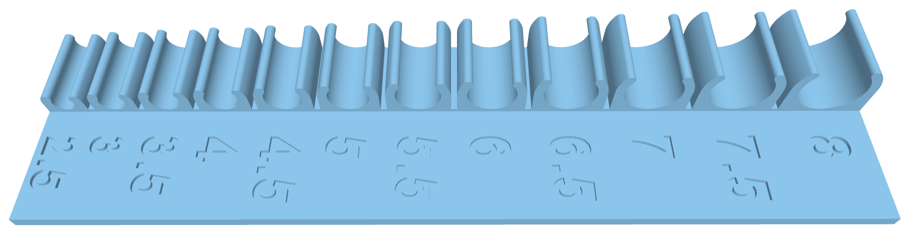
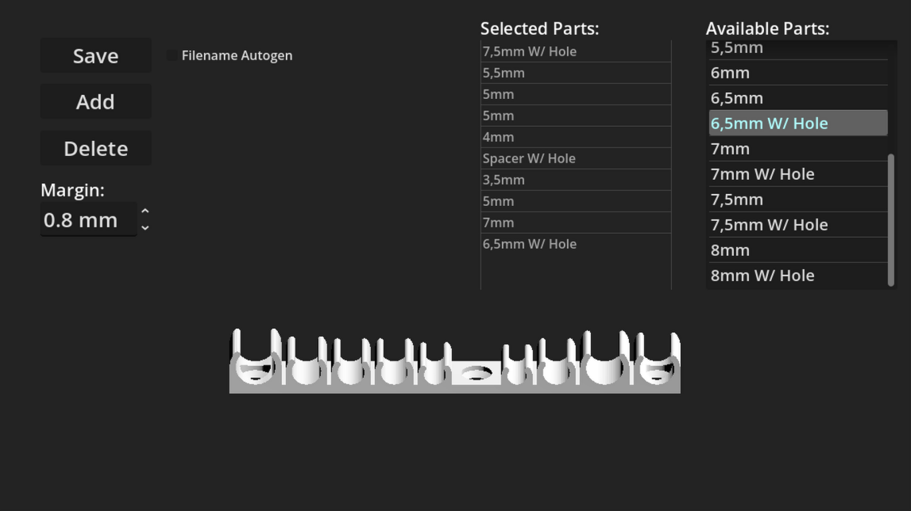

# Custom Cable Clip Generator

This tool allows to easily generate custom fitted 3d printable cable clip .stl files to screw / tape on walls.
Its developed in Godot 4.7. 

## Installation:
Go to [releases](https://github.com/FatBrotherGames/CableClipGenerator/releases) and download the latest `cable_clip_gen_X_X-win64.zip` or `cable_clip_gen_X_X-linux64.zip`, depending on your os.
Unpack the zip and start the executable. 

I HIGHLY recommend 3d Printing the clip_template.stl to check/measure which clip sizes are needed when desinging the cable clips.

## How to use:

Save Button: Starts save process if there is at least one cable clip part in the "Selected Parts List".

Checkbox Filename Autogen: Checking this enables automatic name generation for the exported files based on the parts used.

Add Button: The selected item in the "Available Parts" List will be added to the "Selected Parts List".

Delete Button: Deletes last item in the "Selected Parts List".

Margin: This number is used to set the space/margin between the parts.

Selected Parts List: This displays the current build. Double clicking a part will delete it.

Available Parts List: This displays the available parts to generate. Double clicking a part will add it to the current build.

TODO:
1. Sensible variable naming - DONE
2. Fix the flipped normals on the exported .stl files. PrusaSlicer does not mind much, but other slicers might. :( - FIXED :)
3. Code Cleanup and documentation comments if needed - DONE ENOUGH :D
4. Tutorial for use ( this be rather short ) - DONE
5. Releases for Linux 64/32 Win 64/32

THIRD_PARTY_NOTICES:

godot-stl-io by onze - MIT License   ---   https://github.com/onze/godot-stl-io -- godsend plugin, many thanks :)
